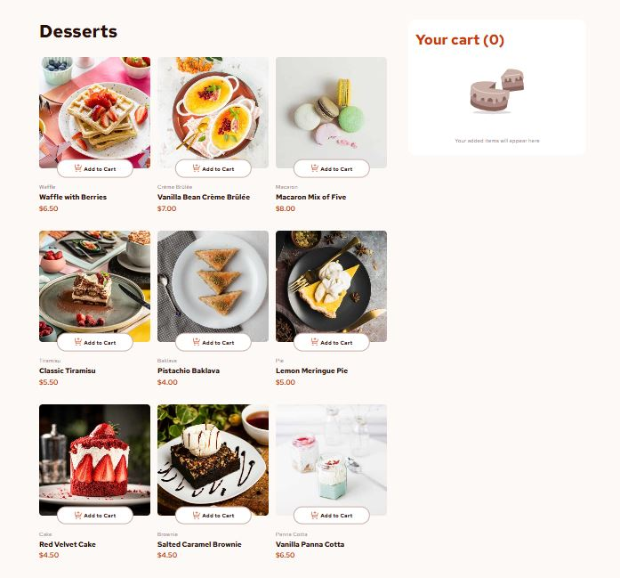

# Frontend Mentor - Product List with Cart Solution

This is a solution to the [Product list with cart challenge on Frontend Mentor](https://www.frontendmentor.io/challenges/product-list-with-cart-5MmqLVAp_d). Frontend Mentor challenges help improve coding skills by building realistic projects.

## Table of contents

* [Overview](#overview)

  * [The challenge](#the-challenge)
  * [Screenshot](#screenshot)
  * [Links](#links)
* [My process](#my-process)

  * [Built with](#built-with)
  * [What I learned](#what-i-learned)
  * [Continued development](#continued-development)
  * [Useful resources](#useful-resources)
* [Author](#author)
* [Acknowledgments](#acknowledgments)

## Overview

### The challenge

Users should be able to:

* Add items to the cart and remove them
* Increase/decrease the number of items in the cart
* See an order confirmation modal when they click "Confirm Order"
* Reset their selections when they click "Start New Order"
* View the optimal layout for the interface depending on their device's screen size
* See hover and focus states for all interactive elements

### Screenshot


*(Add your screenshot in the project folder and replace the file path if necessary.)*

### Links

* Solution URL: [GitHub Repository](https://github.com/innerweb404-web/product-list-with-cart-main)
* Live Site URL: [Your Live Site Here](https://your-live-site-url.com)

## My process

### Built with

* React.js
* CSS Grid & Flexbox
* Styled Components
* Mobile-first workflow
* Semantic HTML5

### What I learned

* How to manage component state with `useState`
* Using `map()` to render product lists dynamically
* Handling events like add/remove items from cart
* Displaying modals and managing visibility
* Responsive design using CSS Grid and media queries

Example code snippet:

```js
// Increment cart item quantity
const increment = (id) => {
  setCartItems(prev =>
    prev.map(item => item.id === id ? {...item, quantity: item.quantity + 1} : item)
  );
};
```

### Continued development

* Learn to integrate **Context API** or **Redux** for more scalable state management
* Add **localStorage** to persist cart items between sessions
* Improve accessibility (ARIA roles, keyboard navigation)

### Useful resources

* [React Documentation](https://reactjs.org/docs/getting-started.html) – Official React docs, very helpful for understanding hooks and components.
* [Frontend Mentor](https://www.frontendmentor.io/) – Challenge inspiration and layout ideas.

## Author

* GitHub - [@innerweb404-web](https://github.com/innerweb404-web)
* Frontend Mentor - [@innerweb404-web](https://www.frontendmentor.io/profile/innerweb404-web)

## Acknowledgments

* Thanks to Frontend Mentor for providing the challenge and assets
* Inspired by various React tutorials for best practices in state management and component structure

---
